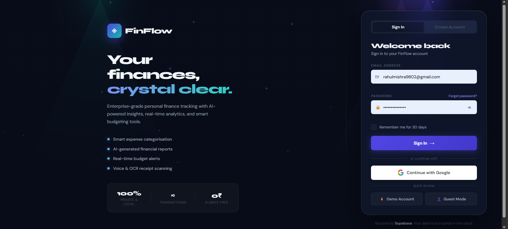
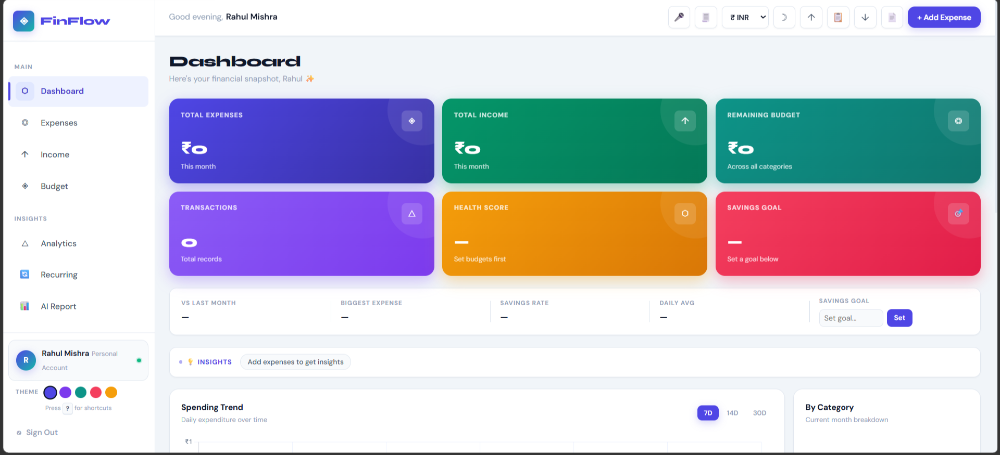
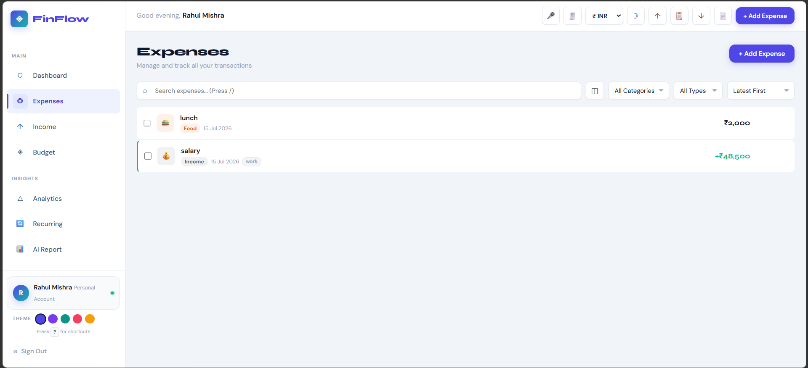
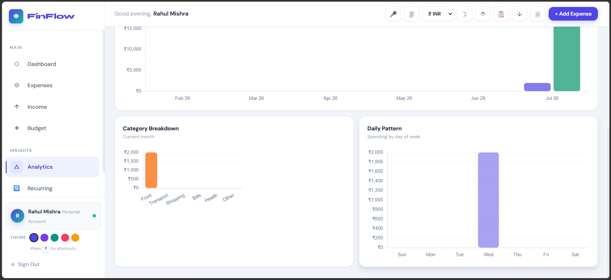

# 💰 FinFlow

A modern Personal Finance Management Web Application that helps users track income, expenses, budgets, savings, and financial analytics in one place.

Built using **HTML, CSS, JavaScript, and Supabase**, FinFlow provides secure authentication, cloud storage, and an intuitive dashboard for managing personal finances.

---

## 🚀 Live Demo

🔗 https://your-netlify-link.netlify.app

---

## 💻 GitHub Repository

🔗 https://github.com/yourusername/FinFlow

---

# ✨ Features

- 🔐 Secure User Authentication
- 💰 Income Management
- 💸 Expense Management
- 📊 Interactive Dashboard
- 🎯 Budget Planning
- 📈 Financial Analytics
- 📉 Spending Trend Visualization
- 🥧 Expense Category Charts
- ☁️ Cloud Database using Supabase
- 📱 Responsive Design

---

# 🛠 Tech Stack

| Category | Technology |
|----------|------------|
| Frontend | HTML5, CSS3, JavaScript |
| Backend | Supabase |
| Database | PostgreSQL |
| Authentication | Supabase Auth |
| Charts | Chart.js |
| Deployment | Netlify |

---
> A modern Personal Finance Management Web Application built with HTML, CSS, JavaScript and Supabase.
# 📸 Screenshots








---

# 📁 Project Structure

```
FinFlow/
│
├── assets/
├── auth/
├── css/
├── js/
├── screenshots/
├── index.html
├── login.html
├── supabase_schema.sql
└── README.md
```

---

# 🌟 Future Enhancements

- AI-powered financial insights
- OCR receipt scanner
- PDF & Excel export
- Email reminders
- Multi-currency support
- Dark mode
- Mobile application

---

# 👨‍💻 Developer

**Rahul Mishra**

B.Tech Computer Science (Data Science & AI)

Shri Ramswaroop Memorial University, Lucknow

📧 Email: rahulmishra9802@gmail.com

🔗 GitHub: https://github.com/Rahul9804mishra

🔗 LinkedIn: www.linkedin.com/in/rahul-mishra-335257311

---

## ⭐ Support

If you found this project useful, consider giving it a **⭐ Star** on GitHub.